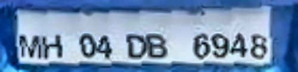

# License plate detection and recognition in unconstrained scenarios

The main objective is the problem is to be able to extract the license plate number from the given image using deep learning based and classical algorithms.

## Folders

+ character-recog : used for training character recognition on segmented images.
+ lp-recog : used to train end-to-end model and license plate recognition model.
+ submission : contains files necessary only for prediction and inference.

Readme in the respective directory directs the use of the files.

## Setup

Run the following code in the terminal to get started locally:<br>
To run in virtual env

```shell
python3 -m venv lp_ocr
. lp_ocr/bin/activate
```

Install dependencies

```shell
cd submission
pip3 install -r requirements.txt
```

## Dataset and Pre-trained weights

+ Download the dataset and pre-trained weights from [here](https://drive.google.com/drive/folders/1A6T13HtT3B7UuqwKJDyuCk17pVvZe0b3?usp=sharing)
+ Place the weights in *submission* folder.
+ Place the *dataset_characters.zip* file in *character-recog* folder and other 2 zip dataset files in *lp-recog* folder.

## Approach

Our approach is split into 3 sub-tasks, namely:

1. Segementing characters out from the license plate.
2. Character recognition of segmented license plate.
3. License plate detection from images and videos containing full images of cars.

---

## 1. Segmenting characters from license plate

<div align="center">

</div>

### Techniques used

+ For the images having poor contrast, character segmentation and contour detection becomes
much difficult. Like for the images of number plates taken in poor lighting conditions. To
deal with it we used a technique called as **CLAHE** (Contrast Limited Adaptive Histogram Equalization).</br>
`clahe=cv2.createCLAHE(clipLimit=3., tileGridSize=(8,8))`

<div align="center">


</div>

+ To deal with noisy images we used **cv2.fastNlMeansDenoisingColored** function which is basically
implementation of Non-local Means Denoising algorithm. This algorithm replaces the value of a 
pixel by an average of a selection of other pixels values.</br>
`image = cv2.fastNlMeansDenoisingColored(image ,None,10,10,7,21)`

<div align="center">


</div>

+ To clean and extract more information from the plate further, we extracted Value channel from the 
HSV format of image and applied adaptive thresholding to reveal the characters on the license plate
and further applied dilation using **cv2.morphologyEx** function to join the broken parts of characters.</br>
`thresh = cv2.morphologyEx(thresh, cv2.MORPH_DILATE, kernel)`

<div align="center">


</div>

+ For contour detection after image processing, we passed RETR_TREE as argument in cv2.findContours
function and selected only those contours that are of a size bigger that 1/200th Area of the image,
or are not bigger than half the image size.</br>
A further classification of height not less that 1/5th of the image height, and width not more
than 1/5th of the image width was also added to remove the inherent noise in the given number plate.
Cases like 'O' and 'D' where one contour was inside another contour were also taken care of.
</br>`contours,_=cv2.findContours(iwl_bb,cv2.RETR_TREE,cv2.CHAIN_APPROX_SIMPLE)`

<div align="center">


</div>

<div align="center">


</div>

### Executing code

```shell
cd submission
python3 segmentation.py <path_to_image>
```

---

## 2. Character recognition of segmented license plate

### Data augmentations

+ Dataset can be found in *character-recog/dataset_characters.zip*
+ The dataset we have mainly consists of centered and vertically aligned images and does not reflect most of the real world license plate segmented images such are titled and off set images. We hence add these images in form of data augmentations on the already exsisting images using [Albumentations library](https://albumentations.ai/).

```python
A.OneOf([
    A.ShiftScaleRotate(always_apply=False, p=0.3, shift_limit=(0.0, 0.0), scale_limit=(0.0, 0.0), rotate_limit=(-10, 10), interpolation=0, border_mode=0, value=(0, 0, 0), mask_value=None),
    A.ShiftScaleRotate(always_apply=False, p=0.3, shift_limit=(-0.1, 0.1), scale_limit=(0.0, 0.0), rotate_limit=(0, 0), interpolation=0, border_mode=0, value=(0, 0, 0), mask_value=None),
    A.ShiftScaleRotate(always_apply=False, p=0.3, shift_limit=(0.0, 0.0), scale_limit=(-0.1, 0.1), rotate_limit=(0, 0), interpolation=0, border_mode=0, value=(0, 0, 0), mask_value=None),
    A.ShiftScaleRotate(always_apply=False, p=0.1, shift_limit=(-0.1, 0.1), scale_limit=(-0.1, 0.1), rotate_limit=(-10, 10), interpolation=0, border_mode=0, value=(0, 0, 0), mask_value=None),
],p=1.0),
```

### Model

+ We implemented our deep learning models in [PyTorch](https://pytorch.org/), as its the growing industry and academia standard.
We initially experimented with custom models by combining few blocks of cnn, batchnorm and max pool and ended with fully connected layers.But the result was not satisfactory hence we used pretrained imagenet models such as *ResNets* and *EfficientNets*.
The table below sumarises the results we obtained after resonable training period of each model.

|Model|Pretrained on|Accuracy<sup>val|
|--- | --- |--- |
|akbhd|-|88.75|
|vatch|-|85.31|
|drklrd|-|92.64|
|ResNet18|ImageNet|98.67|
|**ResNet34**|ImageNet|**98.72**|
|ResNet50|ImageNet|98.53|
|EfficientNet-b0|ImageNet|98.63|
|EfficientNet-b1|ImageNet|98.67|
</br>


<div align="center">ResNet34 architecture</div>
</br>

+ Ensembling models: After training sufficient number of models we ensembled a combination of them but we could not find any improvement on our dataset and also on the segmented images obtained from few real word license plate images. The models' ensemble gave the same accuracy as a single ResNet34 but with increased latency.

Ensemble Combo|Accuracy<sup>val
--- |---
ResNet34*3 <br> 3 different trained models|**98.72**
ResNet18+ResNet34+ResNet50|98.61
ResNet34+ResNet50+EfficientNet-b1|98.66
ResNet34+EfficientNet-b0+EfficientNet-b1|98.7
ResNet18+EfficientNet-b0+EfficientNet-b1|98.59
ResNet50+EfficientNet-b0+EfficientNet-b1|98.59
</br>

+ We also experimented with [Tesseract OCR](https://github.com/tesseract-ocr/tesseract), which is pretrained text recongnition model.
    + Tesseract failed to recognise text when images were blurry and rotated.
    + We could not get the python version of the model installed. We even faced several difficulties in installing the package, and even once installed it would break frequently. Hence adequte bench marking of the model could not be performed but it performed reasonably well.

### Executing code

+ **Prediction**</br>
Run the following commands in terminal to predict on a image

```shell
cd submission
python3 predict.py --folder <path_to_folder> --image <path_to_image>
```

+ **Training**</br>
The Readme in character-recog folder describes the purpose of various files employed.</br>
To start training run the following command.

```shell
cd character-recog
python3 train.py
```

Note:
Please change the necessary paths to dataset and checkpoints

### Takeaways

+ Our model is far from perfect, the model struggles to perform accurate predictinos on segemented images as the characters contain
alot of noise and is roughly in the shape of a character. For example : 6 begin predicted as G
+ The model always fails when the license plate is tilted and the segmented images contain adjacent characters.

<div align="center">

</div>

### Further Improvements

+ Increasing datasets sizes and to include actual segmented models.
+ Or increasing more number of augmentations to cover most real world scenarios.
+ Better ensembling techniques.
+ Use an end-to-end model to train on both prediction and segmentation.

---

## 3. License plate detection

+ We used [yolov5](https://github.com/ultralytics/yolov5) object detection algorithms to perform license plate detection on images and videos.

### Dataset creation

+ The dataset can be found in *lp-recog/license_plate_yolov5pytorch.zip*
+ We use [Roboflow.ai](https://app.roboflow.com/) web application to annotate, pre-process, split and change label format of the datasets. The dataset we used is sourced from several sites but were in Pascal VOC format (.xml files) and needed to be converted to yolov5 specific format. We convert the labels into yolov5 format and resize the images to be 640x640 pixels.
</br>

<p align="center">

</p>

</br>

### Models

+ We trained the yolov5s for license plate detection. The results can be seen below
</br>

<p align="center">

</p>

### Executing code

+ **Prediction**</br>
Run the following commands in terminal to predict on a image

```shell
cd submission
python3 detect.py --source <path_to_folder/image> --weights best.pt --device 'cpu' --save-txt
```

+ **Training**</br>
The Readme in lp-recog folder describes the purpose of various files employed.</br>
To start training run the following command.

```shell
cd lp-recog
sh setup_yolov5.sh
sh train_yolov5.sh
```

Note:
Please change the necessary paths to dataset and checkpoints

### Takeaways

+ Our model detected all license plates tested on and could predict around **3fps**. Below are some of the results

<div align="center">


</div>

---

## 4. End to End License plate OCR

+ We trained an end to end object detection model which would segment out the characters and classify them as well. The major advantage of doing so is that, end to end models generally perform better than independenlty trained models as:

    + The parameters are shared between classification and segmentation hence the loss helps improve both the classification and segmentation.
    + Reduces points of failure and is easly to tune.
    + The models trained independenlty may not perform as expected as they are trained on similar data output from previous models but not the exact ones.

### Dataset

+ Dataset path *lp-recog/characters-np_yolov5pytorch.zip*
+ Datasets was created using [Roboflow.ai](https://app.roboflow.com/) and converted into yolo5 format. But the dataset lacks variations and does not reflect real world images hence we added few augmentations within the Roboflow web app.
</br>

<div align="center">

</div>

### Models

+ We trained yolov5s and yolov5l models which gave similar results but yolov5l performed better.

|Model|Precision<sup>val|Recall<sup>val|map<sup>val</br>0.5:0.95|map<sup>val</br>0.5|
|---|---|---|---|---|
|Yolov5L|0.9788|**0.995**|**0.7774**|**0.9951**|    
|Yolov5S|**0.9874**|0.9678|0.684|0.9951|


### Executing code

+ **Prediction**</br>
Run the following commands in terminal to predict on a image.

```shell
cd submission
python3 detect.py --source <path_to_folder/image> --weights end_to_end.pt --device 'cpu' --save-txt
```

+ **Training**</br>
The Readme in lp-recog folder describes the purpose of various files employed.</br>
Change the path of *TRAIN_YAML* file in *train_yolov5.sh* to the yaml file in the dataset and run the following command.

```shell
cd lp-recog
sh setup_yolov5.sh
sh train_yolov5.sh
```

Note:
Please change the necessary paths checkpoints

### Takeaways

+ The dataset being very small and not reflecting most of the possible variations causes the model to miss several characters and misclassify certain images.

<div align="center">


</div>

---

## Further Improvements

+ Our approach of splitting up recognition, segmentation and classification model is not robust and can easily be beaten by an end-to-end model.
+ Hence we wish to train an end-to-end model as done in [subsection 4](#4-end-to-end-license-plate-ocr) but with the following changes:
    + Increase the dataset size to reflect real world images.
    + Or increase the number of augmentations to cover most of the real world images.
    + Use different algorithms such as Instance segmentation as they are more robust and can predict more accuracetly due to pixel-wise classification as oposed a bounding box which may enclose adjacent characters.
+ Our license plate detection model has good accuracy on real world data we could also try to integrate it into the end-to-end model making complete end-to-end pipeline from recogniton to segmentation to classification.